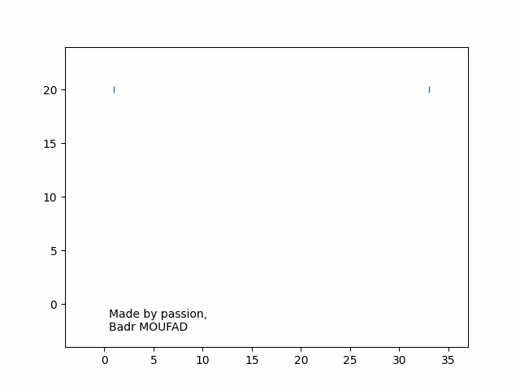

# Animate your name with matplotlib

# Motivation

I have been coding with `Python` for 3 years during which I worked on many professional, academic, and personal projects. 3 years of intense `Python` usage in data science, computational mathematics, and web and UI development.

Countless were the hours where I sat in front of my computer and enjoyed as well as disliked coding with `Python`. In short, I can say that this language has become not only an irreducible part of my day-to-day life but also an unforgettable part of my memories.

Following **Tobias Smollett** quote *"Number 3 is always fortunate"*, and to celebrate these 3 years, there was nothing better than making a tool that animates a given grid using the so-called packages `numpy` and `matplotlib` and particularly to use it to animate my name.


# Usage

If you want to try this tool, firstly you need to clone the repository, create a virtual environment and install requirements. 

If you are not familiar with that, refer to [my test repo](https://github.com/Badr-MOUFAD/test-python-repo) where I detailed these steps.

After doing that, create a new python file `your_python_file.py` within `animate_your_name_src` folder.

### Create an animated grid

The needed modules to build an animated grid are `matplotlib.pyplot` and `class_render_grid`
```python
# imports
import matplotlib.pyplot as plt
from class_render_grid import AnimatedGrid
```

`matplotlib.pyplot` will serve to create a figure where to plot and animate the grid, whereas `class_render_grid.AnimatedGrid` is the core class that contains all the logic for animating a given grid.


After the imports, initialize a figure and axis object to plot and show the animation
```python
# init fig where to draw animation
fig, ax = plt.subplots()
```


Input the grid you want to animate as a 2D array.
I realized that is a bit complicated to create either manually or by code a grid, especially for complex shapes. Therefore, I created a user interface that eases this operation. Follow [this link](https://animate-your-name-dashboard.vercel.app/) to access the user interface and [this link](https://github.com/Badr-MOUFAD/animate-your-name-dashboard) for detail about the repository
```python
# an example of a 2x2 grid
grid = [[1, 0], [0, 1]]
```

Finally, create an instance of Animated grid and then launch / save the animation
```python
# init object
g = AnimatedGrid(fig=fig, ax=ax, grid=grid)

# animate
# an save animation
g.animate(pathname="screenshots/example_animated_grid.gif")

# show the animation
plt.show()
```

An example script can be found at `animate_your_name_src/example_usage.py`


# Animating my name

Following the steps above, 

<div style="display: flex; justify-content: center; margin-top: 20px; margin-bottom: 20px;">
    
</div>


> **Note:** The prime trigger to concretize this idea was my desire to offer animation as a gift to a close friend for his birthday.